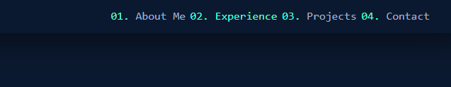
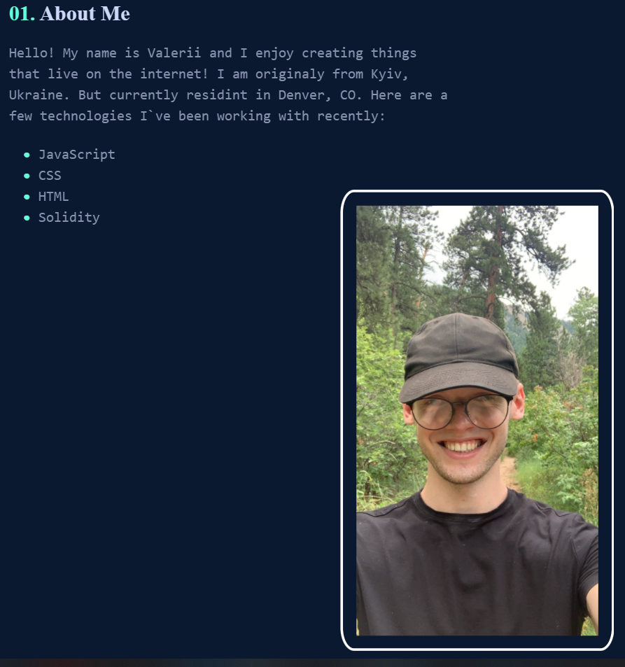
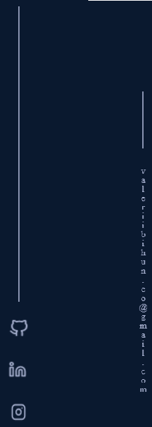
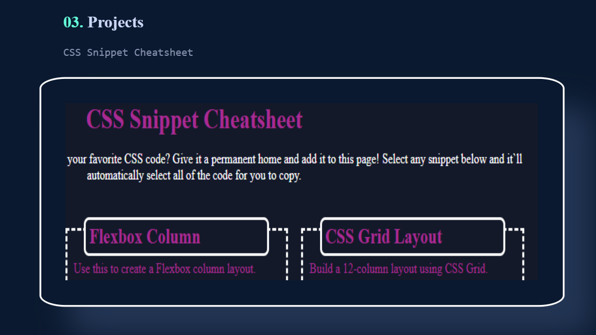
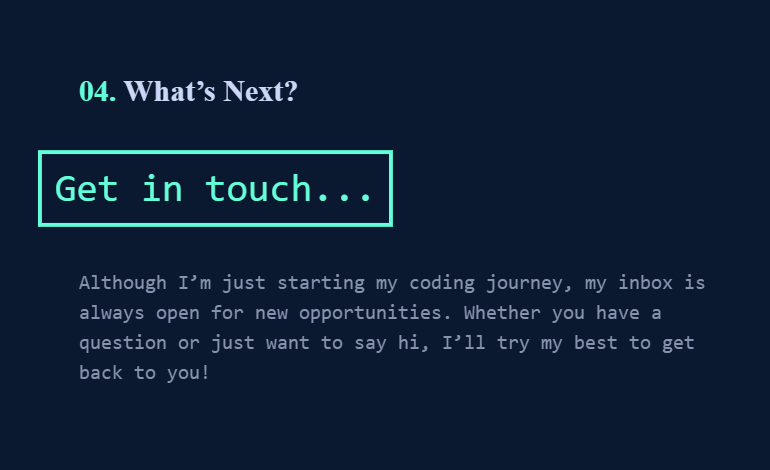

# My Portfolio

## Description

This is Valerii Bihun`s Portfolio.
A programmer portfolio is more than a simple resume - it showcases and proves that you can do what is mentioned in the resume.

This project is going to be the base of my future portfolio and will be imprived as I get more skillful.

## Table of Contents
- [Installation](#installation)
- [Usage](#usage)
- [Credits](#credits)
- [License](#license)

## Installation
Current project has been saved in my personal GitHub repository and is currently available for cloning and reviews on:

https://github.com/Valllerian/Portfolio

## Usage
Websites includes some usable links to navigate through content:

 

 

Each link would bring us to the corresponding paragraph:

(Avatar picture also has a hover class added to imitate the filter)

 

 

There is a nav bar on the left and right part of the screen. 

Left one - icons of social media with direct links on-click.

On the right - active link to send an email.

 

 

There are screenshots of main projects in "Project" section of the portfolio.

Each of them increases in size when hovered, filter added, create shadow, border changes color and screenshots are also clickable links that lead to the project website.

 

 

In the last section of the portfolio "Contact me" there is an active "button" to contact me via email.

 

 

## Credits
Following resources  have been used while working on the project:

1) W3Schools has been used to get some more understanding on the code functionality, pseudo classes, img positioning etc:

    https://www.w3schools.com/

2) Stackoverflow was used to find information on creating nav bars:

    https://stackoverflow.com/

3) Following ReadMe Tutorial has helped me to write a proper, well-structured ReadMe file:

    https://coding-boot-camp.github.io/full-stack/github/professional-readme-guide

4) List of licenses:

    https://choosealicense.com/

## License
Current project is unlicensed. Which means - "Anyone is free to copy, modify, publish, use, compile, sell, or
distribute this software, either in source code form or as a compiled
binary, for any purpose, commercial or non-commercial, and by any
means." (Quote for source #3)
